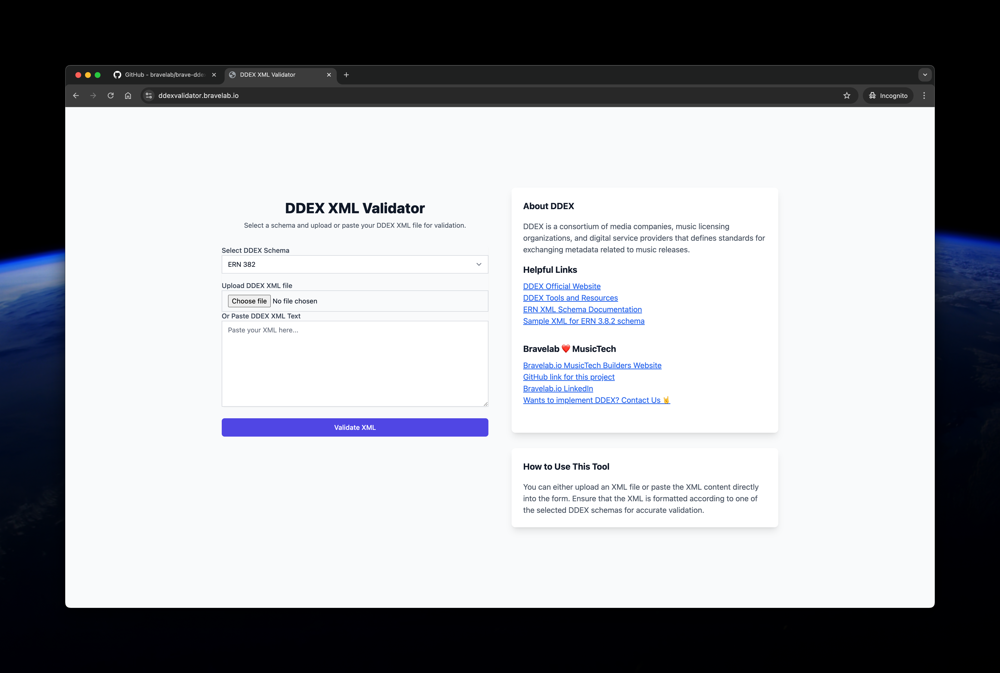

# DDEX XML Validator



This is a Django-based application for validating DDEX XML files against various DDEX schema versions. Users can upload an XML file or paste XML text to validate against specific DDEX schemas.

## Features
- Validate DDEX XML files by uploading or pasting XML content.
- Supports various versions of DDEX schemas fetched dynamically from the DDEX directory.
- Displays detailed validation errors if the XML file does not conform to the selected schema.

## Installation

1. **Clone the Repository**

   ```bash
   git clone https://github.com/bravelab/brave-ddexvalidator.git
   cd brave-ddexvalidator
   ```

2. **Set Up Poetry Environment**

   If you don't have Poetry installed, you can install it using the following command:

   ```bash
   curl -sSL https://install.python-poetry.org | python3 -
   ```

3. **Install Dependencies Using Poetry**

   Run the following command to install all dependencies:

   ```bash
   poetry install
   ```

4. **Activate the Virtual Environment**

   Poetry automatically creates a virtual environment for your project. Activate it using:

   ```bash
   poetry shell
   ```

5. **Set Up Django Environment**

   Update the settings file if needed (i.e., `ddexvalidator/settings.py`) with your database or other configurations.

   Apply migrations to set up the database:

   ```bash
   poetry run python manage.py migrate
   ```

6. **Run the Development Server**

   ```bash
   poetry run python manage.py runserver
   ```

   Access the app at `http://127.0.0.1:8000/`.

## Usage

1. **Upload an XML File or Paste XML Content**
   - Choose a DDEX schema version from the dropdown.
   - Either upload a DDEX XML file or paste the XML text.
   - Submit the form for validation.
   
2. **View the Validation Results**
   - If the XML is valid, a success message will be displayed along with the formatted XML.
   - If invalid, detailed error messages will be shown indicating the issues with the XML.

## Running Tests

1. **Install `pytest` and `pytest-django` Using Poetry**

   If you haven't already installed the test dependencies, use:

   ```bash
   poetry add --dev pytest pytest-django
   ```

2. **Run the Tests**

   ```bash
   poetry run pytest
   ```

   This will execute all the tests defined in the application.

## Directory Structure

```plaintext
ddex-validator/
│
├── ddexvalidator/                  # Django project folder
│   ├── settings.py                 # Django project settings
│   ├── urls.py                     # Project URLs
│   ├── wsgi.py                     # WSGI entry point for production
│   └── ...
│
├── validator/                      # App folder
│   ├── forms.py                    # Django forms
│   ├── views.py                    # Core views
│   ├── templates/validator/        # HTML templates
│   └── tests.py                    # Test file for form validation
│
├── static/                         # Static files (Tailwind CSS, etc.)
│   └── css/                        # Compiled Tailwind CSS files
│
├── templates/                      # Base templates
│   └── base.html                   # Base template for all pages
│
├── poetry.lock                     # Poetry lock file
├── pyproject.toml                  # Poetry project configuration
├── manage.py                       # Django management script
└── README.md                       # This file
```

## Schema Versions Supported

The following DDEX schema versions are dynamically fetched and supported by this app:

- ERN 3.8.2
- ERN 4.1.1
- (Additional versions based on the available schemas in the DDEX directory)


## License
This project is licensed under the MIT License.
